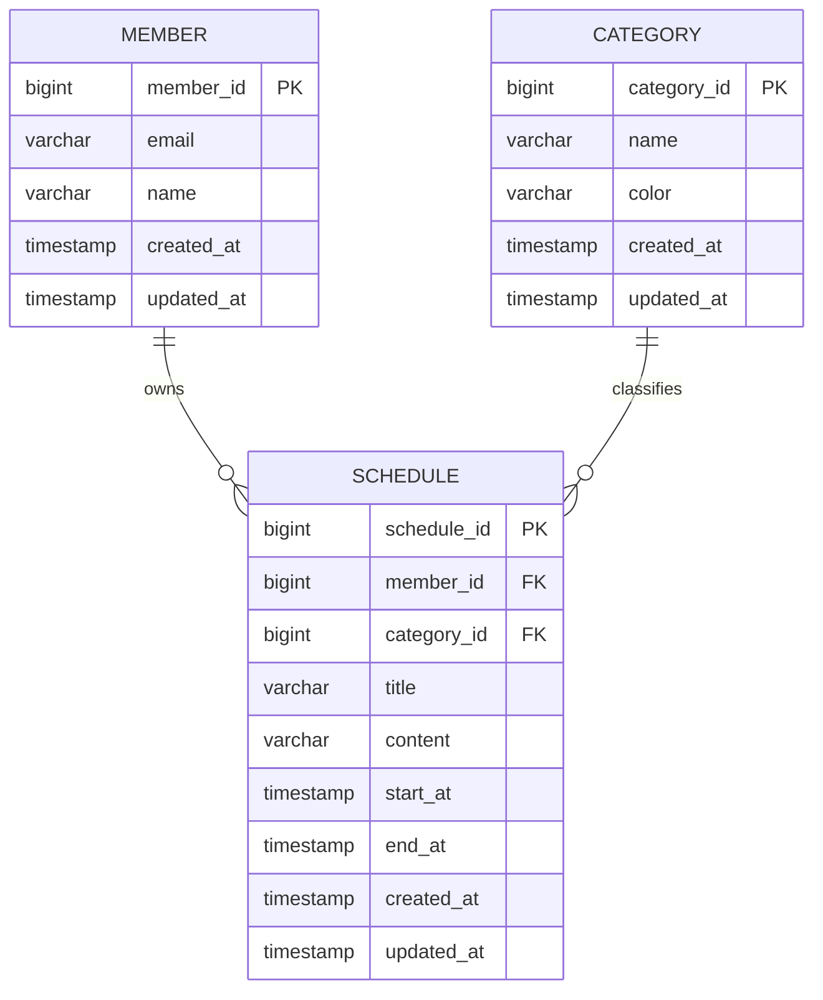
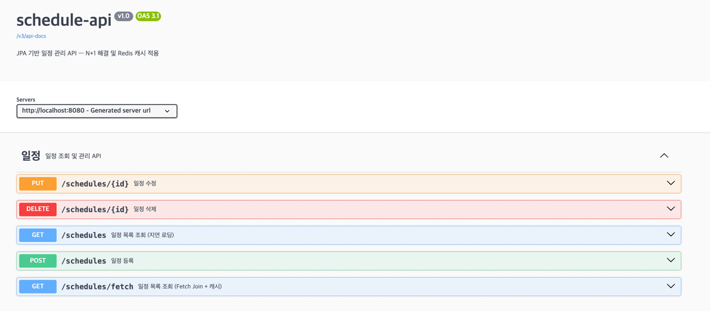

# schedule-api

[](https://github.com/jeonchaerim/schedule-api/actions/workflows/ci.yml)

> Spring Data JPA와 Redis를 활용한 일정 관리 REST API
> JPA 연관관계에서 발생하는 N+1 문제를 재현하고 Fetch Join으로 해결했으며,
> Redis 캐싱과 캐시 무효화를 적용해 각 단계의 쿼리 수·응답 시간을 측정했습니다.

SI 환경에서 3년 6개월간 백엔드를 개발하며 MyBatis 기반 작업 비중이 높았고,
JPA는 부분적으로만 접했습니다. SQL을 직접 작성하던 방식에서 벗어나
JPA가 실제로 어떤 쿼리를 생성하는지 확인하기 위해 만든 프로젝트입니다.

기능 구현보다 동작 원리 확인에 초점을 맞춰, N+1 문제를 재현하고 해결하는
과정에서 쿼리 수와 응답 시간이 어떻게 변하는지 단계별로 측정해 기록했습니다.

## 주요 기능

- 일정 등록 / 조회 / 수정 / 삭제
- 회원·카테고리 연관관계 매핑 (카테고리는 선택 항목)
- 지연 로딩 / Fetch Join 조회를 별도 엔드포인트로 분리해 성능 비교
- Redis 캐시 적용 및 데이터 변경 시 캐시 무효화
- Swagger 기반 API 문서 자동화

## 기술 스택

| 분야 | 기술 |
| --- | --- |
| Language | Java 17 |
| Framework | Spring Boot 4.1, Spring Data JPA |
| Database | H2 in-memory (local 프로필) / PostgreSQL (docker 프로필) |
| Cache | Redis |
| Docs | springdoc-openapi (Swagger UI) |
| Build | Gradle 9.5 |
| Container | Docker, Docker Compose |

## 프로젝트 구조

```
src/main/java/io/github/jeonchaerim/schedule_api/
├── config/          # Redis 캐시, Swagger 설정
├── controller/      # REST API 엔드포인트
├── domain/          # 엔티티 (Member, Category, Schedule, BaseTimeEntity)
├── dto/             # 요청·응답 DTO
├── exception/       # 전역 예외 처리
├── repository/      # JPA Repository
└── service/         # 비즈니스 로직
```

## ERD



- `Schedule`이 `member_id`, `category_id`를 FK로 보유 — 연관관계의 주인
- `category_id`는 nullable — 카테고리 없는 일정을 허용
- 모든 `@ManyToOne`은 지연 로딩(LAZY)으로 설정
- 생성·수정 일시는 `@MappedSuperclass` + JPA Auditing으로 공통 처리

## 설계 시 고려한 점

- **엔티티에 setter를 두지 않음**
  변경 지점을 추적할 수 있고, 여러 필드를 함께 검증해야 하는 규칙
  (시작 시간 ≤ 종료 시간)을 강제할 수 있습니다. setter로 필드를 하나씩
  바꾸면 중간에 규칙이 깨진 상태가 존재할 수 있습니다.

- **모든 연관관계를 LAZY로 설정**
  EAGER는 `findById`에서는 조인으로 동작하지만 JPQL에서는 쿼리를 그대로
  번역한 뒤 연관 엔티티를 채우려 추가 쿼리를 발생시켜 오히려 N+1을
  유발합니다. 기본은 LAZY로 두고 필요한 조회에서만 Fetch Join을 명시했습니다.

- **양방향 연관관계를 만들지 않음**
  현재 요구사항에 필요하지 않고, 컬렉션(`@OneToMany`) Fetch Join 시
  발생하는 행 중복·페이징 제약을 피하기 위해 단방향으로 설계했습니다.

- **조회 전용 트랜잭션 분리**
  Service 클래스에 `@Transactional(readOnly = true)`를 기본으로 두고
  쓰기 메서드만 재정의했습니다. Dirty Checking을 위한 스냅샷 생성이 생략되어
  동일 조회에서 응답 시간이 2,431ms → 676ms로 줄었습니다.
  (자세한 측정 결과는 아래 [성능 개선 결과](#성능-개선-결과) 참고)

## 사전 요구사항

| 항목 | 버전 |
| --- | --- |
| JDK | 17 이상 |
| Redis | 6.0 이상 (로컬 6379 포트) |
| Gradle | Wrapper 포함 — 별도 설치 불필요 |

> 별도의 DB 설치는 필요하지 않습니다. H2 인메모리를 사용하며
> 애플리케이션 기동 시 스키마와 더미 데이터가 자동 생성됩니다.

## 실행 방법

**1. Redis 실행**

```bash
redis-server --daemonize yes
redis-cli ping   # PONG
```

**2. 애플리케이션 실행**

```bash
git clone https://github.com/jeonchaerim/schedule-api.git
cd schedule-api
./gradlew bootRun
```

**3. 접속**

| | URL |
| --- | --- |
| Swagger UI | http://localhost:8080/swagger-ui/index.html |
| H2 Console | http://localhost:8080/h2-console |

H2 Console 접속 정보 — JDBC URL: `jdbc:h2:mem:testdb` / User: `sa` / Password: 없음

> 애플리케이션 기동 시 성능 측정을 위한 더미 데이터가 자동 생성됩니다.
> (회원 1,000명 / 일정 2,000건)

### 실행 시 자주 발생하는 문제

**`RedisConnectionFailureException: Unable to connect to Redis`**

Redis 서버가 실행 중이 아닌 경우입니다. `redis-cli ping`으로 `PONG` 응답을
확인한 뒤 애플리케이션을 실행하세요.

```bash
redis-server --daemonize yes
```

**H2 Console에서 테이블이 보이지 않는 경우**

JDBC URL이 `jdbc:h2:mem:testdb`인지 확인하세요. 인메모리 DB이므로
애플리케이션이 실행 중일 때만 접속 가능합니다.

**포트 8080이 이미 사용 중인 경우**

```bash
lsof -i :8080
kill -9 <PID>
```

## Docker로 실행하기

PostgreSQL + Redis + 애플리케이션을 한 번에 띄웁니다 (`docker` 프로필로 기동,
로컬 Redis/Gradle 설치가 필요 없습니다).

```bash
cp .env.example .env
docker compose up -d --build
```

| | URL |
| --- | --- |
| Swagger UI | http://localhost:8080/swagger-ui/index.html |
| Health Check | http://localhost:8080/actuator/health |

**상태·헬스체크 확인**

```bash
docker compose ps                              # app/postgres/redis 3개 모두 healthy인지 확인
curl http://localhost:8080/actuator/health     # {"status":"UP"}
```

**종료**

```bash
docker compose down      # 컨테이너만 제거 (postgres 볼륨은 유지되어 데이터 보존)
docker compose down -v   # 볼륨까지 제거하고 완전히 초기화
```

> `local`(H2) ↔ `docker`(PostgreSQL) 전환은 `SPRING_PROFILES_ACTIVE`로
> 이루어지며, `docker-compose.yml`의 `app` 서비스가 이를 `docker`로 지정합니다.
> `ddl-auto`는 local은 `create`(매 기동 시 초기화), docker는 `update`(데이터 유지)로
> 분리되어 있어, 컨테이너를 재기동해도 등록한 데이터가 유지됩니다. 초기 더미
> 데이터(회원 1,000명 / 일정 2,000건)는 최초 기동 시 한 번만 생성됩니다.

## 테스트

Service·Repository·Controller 세 계층 모두 테스트를 작성했습니다.

```bash
./gradlew test
```

**Service** — JUnit5 + Mockito, Repository는 전부 Mock 처리

| 대상 | 케이스 | 검증 내용 |
| --- | --- | --- |
| `findAll` / `findAllWithFetch` | 정상 | Schedule을 ScheduleResponse로 매핑 |
| `create` | 정상 | 회원·카테고리 조회 후 저장, id 반환 |
| `create` | 예외 | 존재하지 않는 회원 id면 `IllegalArgumentException` |
| `update` | 정상 | categoryId 없으면 카테고리 제거, `save()` 미호출(Dirty Checking) |
| `update` | 예외 | 존재하지 않는 일정 id면 `IllegalArgumentException` |
| `delete` | 예외 | 존재하지 않는 일정 id면 `IllegalArgumentException` |

**Repository** — `@DataJpaTest` (내장 H2)

| 대상 | 검증 내용 |
| --- | --- |
| `save` / `findById` / `findAll` / `delete` | 기본 CRUD |
| `update()` + flush | 엔티티 변경이 실제 DB에 반영되는지 (1차 캐시 clear 후 재조회) |
| `findAllWithMemberAndCategory` | fetch join으로 연관관계가 채워지는지, 카테고리 없는 일정도 포함되는지 |

**Controller** — `@WebMvcTest` + MockMvc, Service는 `@MockitoBean` 처리

| 엔드포인트 | 정상 케이스 | 예외/대안 케이스 |
| --- | --- | --- |
| `GET /schedules` | 목록 반환 | 빈 목록 반환 / Service 예외 시 400 |
| `GET /schedules/fetch` | 목록 반환 | 빈 목록 반환 / Service 예외 시 400 |
| `POST /schedules` | id 반환 (200) | 기간 검증 실패 시 400 + 에러 메시지 |
| `PUT /schedules/{id}` | 200 | 존재하지 않는 id면 400 + 에러 메시지 |
| `DELETE /schedules/{id}` | 200 | 존재하지 않는 id면 400 + 에러 메시지 |

## CI

`main` 브랜치로 push하거나 PR을 열면 [GitHub Actions](.github/workflows/ci.yml)가
자동으로 JDK 17 환경에서 `./gradlew build`(전체 테스트 포함)를 실행합니다.

- Gradle 의존성은 `actions/setup-java`의 내장 캐시로 재사용되어 빌드 시간을 줄입니다.
- 테스트가 하나라도 실패하면 워크플로우 전체가 실패로 표시됩니다.
- 성공/실패 여부와 무관하게 테스트 리포트가 Actions 실행 결과의 Artifacts로 업로드됩니다.

상단의 CI 배지가 `passing`이면 `main` 브랜치의 최신 커밋이 빌드·테스트를
통과했다는 뜻입니다.

## API 명세

| Method | URI | 설명 |
| --- | --- | --- |
| GET | `/schedules` | 일정 목록 조회 — 지연 로딩 (N+1 발생) |
| GET | `/schedules/fetch` | 일정 목록 조회 — Fetch Join + Redis 캐시 |
| POST | `/schedules` | 일정 등록 |
| PUT | `/schedules/{id}` | 일정 수정 — Dirty Checking |
| DELETE | `/schedules/{id}` | 일정 삭제 |

> `/schedules`와 `/schedules/fetch`는 N+1 발생과 해결을 비교하기 위해
> 의도적으로 분리한 엔드포인트입니다. 실제 서비스라면 조회 엔드포인트는
> 하나만 두고 Fetch Join을 기본 적용합니다.

**예외 응답**

잘못된 요청은 `@RestControllerAdvice`에서 400으로 변환됩니다.

```json
{ "message": "일정을 찾을 수 없습니다. id=99999" }
```



## 성능 개선 결과

**측정 조건** — 회원 1,000명 / 일정 2,000건, H2 인메모리

| 단계 | 조회 쿼리 수 | 소요 시간 |
| --- | --- | --- |
| 지연 로딩 (`GET /schedules`) | **1,003회** | 약 300ms |
| Fetch Join — 캐시 MISS (`GET /schedules/fetch`) | **1회** | 약 50ms |
| Fetch Join — 캐시 HIT | **0회** | 약 20~30ms |

> 첫 호출은 JVM 워밍업 영향으로 2,000ms 이상 측정되었습니다.
> 절대값은 측정 시점에 따라 흔들렸으나 각 방식 간 비율은 일정하게 유지되어,
> 워밍업 이후 안정화된 값을 기준으로 정리했습니다.

## 트러블슈팅

| 문제 | 원인 | 해결 |
| --- | --- | --- |
| 목록 조회 1건에 쿼리 1,003회 | 지연 로딩 프록시가 건별로 초기화 | Fetch Join |
| 쿼리는 99.9% 줄었으나 응답 개선 미미 | Dirty Checking 스냅샷 생성 비용 | 조회 전용 트랜잭션 |
| 데이터 변경 후 낡은 목록 반환 | 캐시와 DB가 별개 저장소 | `@CacheEvict` |
| CacheManager 빈 생성 실패 | Spring Boot 4.1 캐시 자동설정 부재 | `RedisCacheManager` 직접 등록 |
| 캐시 역직렬화 실패 | JSON에 타입 정보가 없음 | JDK 직렬화로 전환 |
| 카테고리 없는 일정이 조회에서 누락 | `join fetch`는 기본이 inner join | `left join fetch` + null 방어 |
| categoryId 없이 수정하면 카테고리가 사라짐 | `PUT`은 리소스 전체 교체가 표준 시맨틱 | 주석으로 정책 명시 |
| 슬라이스 테스트 컨텍스트 로딩 실패 | 메인 클래스에 직접 붙은 `@EnableCaching`·`@EnableJpaAuditing` | 각자의 `@Configuration` 클래스로 이동 |
| `@MockBean` 클래스 없음 (컴파일 불가) | Spring Boot 4.1에서 제거됨 | `@MockitoBean`으로 대체 |
| docker compose가 `app` 이미지를 못 찾음 | 한글 폴더명이 자동 생성 프로젝트 이름을 깨뜸 | `docker-compose.yml`에 `name` 명시 |
| arm64에서 실행 스테이지 이미지 pull 실패 | `eclipse-temurin:17-jre-alpine`의 arm64 매니페스트 누락 | `eclipse-temurin:17-jre-jammy`로 교체 |

각 항목의 원인 분석과 검증 과정은 **[docs/troubleshooting.md](docs/troubleshooting.md)** 에 정리했습니다.